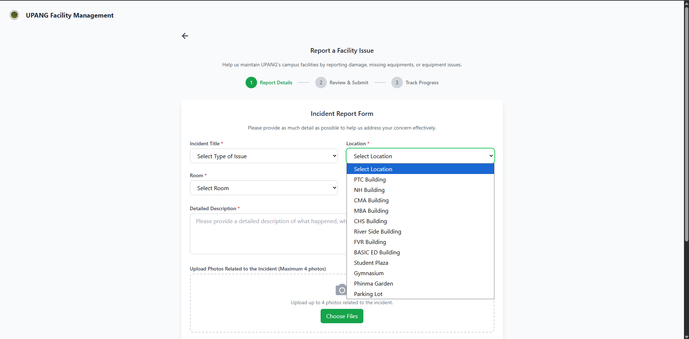
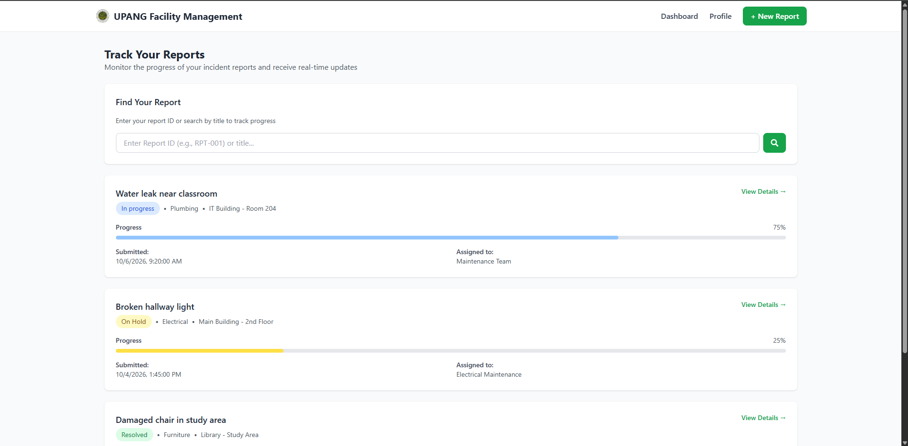
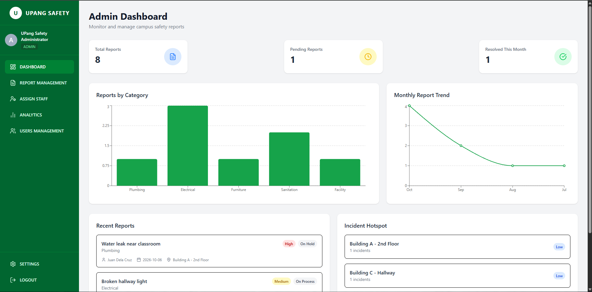
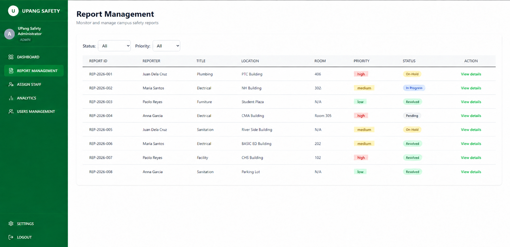

# UPang Safety

UPang Safety is a campus incident reporting and safety management system developed for PHINMA University of Pangasinan. The system provides students and other authorized users with an accessible way to report incidents, track submitted reports, and manage their account, while administrators can review reports, assign staff, manage users, and monitor campus safety information through a centralized dashboard.

## Features

### Frontend
- Secure user authentication
- Submit incident reports with supporting evidence
- Track submitted reports and their current status
- View report details and updates
- Manage user profile information
- Password reset and account recovery

### Admin Portal
- Secure administrator authentication
- Centralized safety dashboard
- Incident report management
- Staff assignment and report handling
- User and staff account management
- Analytics and reporting views
- Administrator profile and system settings

### Backend API
- RESTful API using Node.js and Express.js
- MongoDB database integration with Mongoose
- JWT-based authentication and authorization
- File upload support using Multer
- Email services using Nodemailer
- Dedicated routes and controllers for users, staff, administrators, and incident reports

## Tech Stack

| Area | Technologies |
| --- | --- |
| Frontend | React, React Router, Tailwind CSS, Lucide React |
| Admin Portal | React, Vite, Tailwind CSS, Recharts, jsPDF, html2canvas |
| Backend | Node.js, Express.js |
| Database | MongoDB, Mongoose |
| Authentication | JSON Web Tokens, bcryptjs |
| Additional Tools | Multer, Nodemailer |

## Project Structure

```text
Upang_Safety/
├── admin/                  # Administrator web application
│   ├── public/
│   ├── src/
│   │   └── Components/
│   ├── package.json
│   └── vite.config.js
├── frontend/               # User-facing web application
│   ├── public/
│   ├── src/
│   │   ├── components/
│   │   └── pages/
│   └── package.json
├── backend/                # Node.js and Express API
│   ├── config/
│   ├── controller/
│   ├── middleware/
│   ├── model/
│   ├── routes/
│   ├── uploads/
│   ├── utils/
│   ├── .env.example
│   └── package.json
├── docs/
│   └── screenshots/
├── .gitignore
└── README.md
```

## Core Features

### Frontend — Submit a New Report
Users can submit facility incident reports by selecting the issue type and location, adding a detailed description, and attaching supporting photos.



### Frontend — Track Reports
Users can search and monitor their submitted reports, view the current status and progress, and check the assigned maintenance team.



### Admin — Dashboard
Administrators can monitor report totals, pending and resolved cases, category trends, recent reports, and incident hotspots from one dashboard.



### Admin — Report Management
Administrators can review reports, filter them by status or priority, inspect report details, and manage the handling of each incident.



## Installation and Setup

### Requirements

Before running the system, install:

- Node.js 18 or later
- npm
- MongoDB or a MongoDB connection URI

### 1. Clone the Repository

```bash
git clone <your-repository-url>
cd Upang_Safety
```

### 2. Configure and Run the Backend

```bash
cd backend
npm install
cp .env.example .env
```

Configure the required values inside `backend/.env`:

```env
PORT=5000
MONGO_URI=mongodb://localhost:27017/IncidentReporting_db
JWT_SECRET=your_jwt_secret
JWT_EXPIRES_IN=7d
CLIENT_URL=http://localhost:3000
EMAIL_USER=your_email@example.com
EMAIL_PASS=your_email_app_password
```

Start the backend:

```bash
npm run dev
```

The backend API runs on `http://localhost:5000` by default.

### 3. Run the Frontend

Open another terminal:

```bash
cd frontend
npm install
npm start
```

The frontend runs on `http://localhost:3000` by default.

### 4. Run the Admin Portal

Open another terminal:

```bash
cd admin
npm install
npm run dev
```

The admin portal will run through the local address provided by Vite, typically `http://localhost:5173`.

## Main Application Routes

### Frontend
- `/` — Landing page
- `/signin` — User sign in
- `/dashboard` — User dashboard
- `/report` — Submit an incident report
- `/track-reports` — Track submitted reports
- `/profile` — User profile
- `/reset-password/:token` — Password reset

### Admin Portal
- `/AdminLoginPage` — Administrator sign in
- `/AdminDashboard` — Main dashboard
- `/ReportManagement` — Incident report management
- `/AssignStaff` — Staff assignment
- `/UserManagement` — User and staff management
- `/Analytics` — Analytics and reporting
- `/Settings` — Administrator settings

## Security

- Authentication is handled using JSON Web Tokens.
- User passwords are protected using bcryptjs hashing.
- Sensitive configuration values are stored through environment variables.
- The `.env` file is excluded from version control.
- Uploaded incident evidence is handled separately from the application source code.
- Protected routes and authorization middleware restrict access to authorized users.

## Purpose

The goal of UPang Safety is to provide a more organized and accessible campus safety reporting process. It allows users to report incidents and monitor their status while giving authorized administrators the tools needed to review cases, assign responsible staff, manage users, and maintain a centralized record of safety-related reports.

## Project Status

**Completed** — UPang Safety is presented here as the completed project repository, including the frontend, backend, and administrator application.
