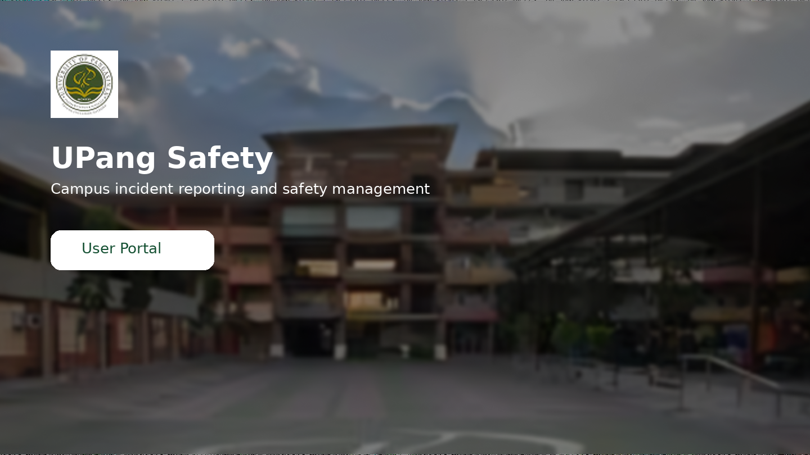
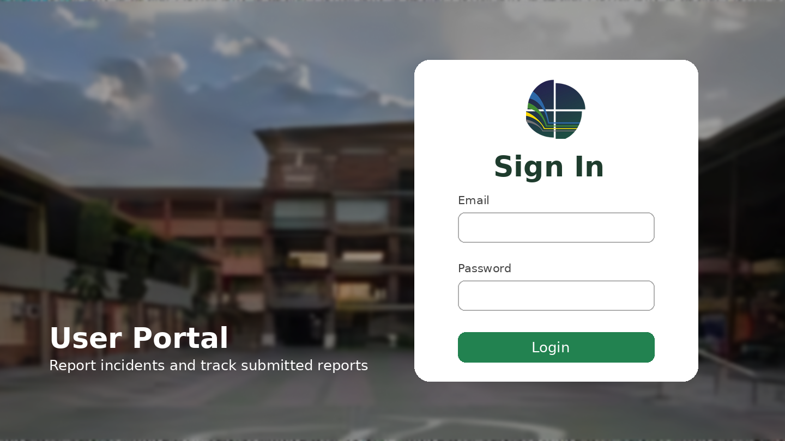
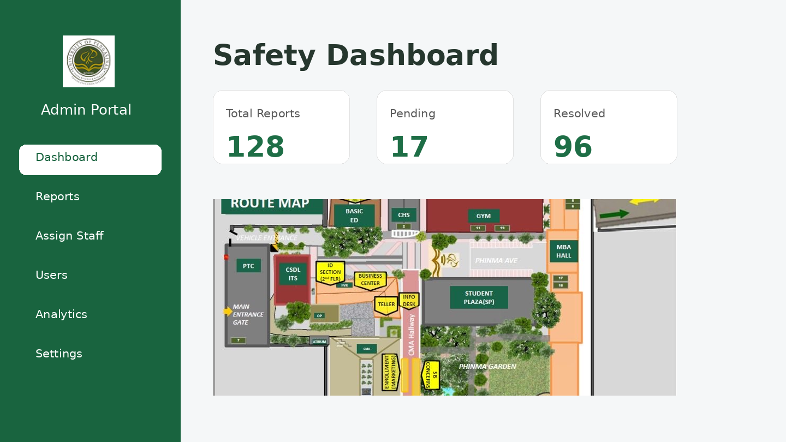
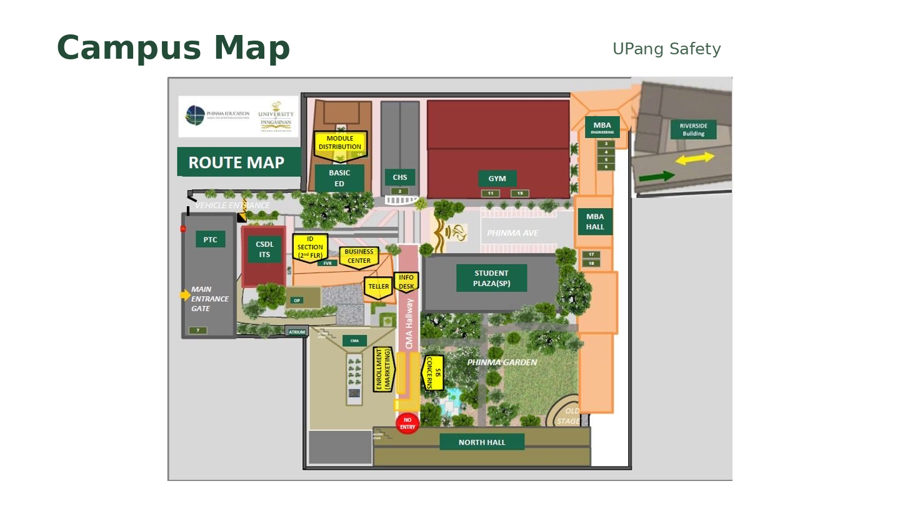

# UPang Safety

UPang Safety is a campus incident reporting and safety management system built for PHINMA University of Pangasinan. It provides a user-facing portal for submitting and tracking incident reports, an admin dashboard for managing reports and users, and a Node.js/Express API backed by MongoDB.

## Features

### User portal
- User authentication and protected routes
- Submit incident reports with supporting evidence
- Track submitted reports and report status
- View and update user profile information
- Password reset flow

### Admin portal
- Admin authentication and dashboard
- Incident report management
- Staff assignment
- User management
- Analytics and reporting views
- Admin profile and settings

### Backend API
- Express-based REST API
- MongoDB with Mongoose
- JWT authentication and authorization middleware
- File upload handling with Multer
- Email support with Nodemailer
- Separate user, professor/staff, admin, and incident modules

## Tech Stack

| Area | Technologies |
| --- | --- |
| User client | React, React Router, Tailwind CSS, Lucide React |
| Admin client | React, Vite, Tailwind CSS, Recharts, jsPDF, html2canvas |
| Server | Node.js, Express.js |
| Database | MongoDB, Mongoose |
| Authentication | JSON Web Tokens, bcryptjs |
| Other | Multer, Nodemailer |

## Repository Structure

```text
Upang_Safety/
├── admin/                  # Admin web application (React + Vite)
│   ├── public/
│   ├── src/
│   │   └── Components/
│   ├── package.json
│   └── vite.config.js
├── client/                 # User web application (React)
│   ├── public/
│   ├── src/
│   │   ├── components/
│   │   └── pages/
│   └── package.json
├── server/                 # Node.js / Express API
│   ├── config/
│   ├── controller/
│   ├── middleware/
│   ├── model/
│   ├── routes/
│   ├── uploads/
│   ├── utils/
│   ├── .env.example
│   └── package.json
├── docs/
│   └── screenshots/
├── .gitignore
└── README.md
```

## Screenshots

> The source archive did not include four complete production UI captures. These repository previews use the project’s existing visual assets and are stored in one place so they can be replaced later without changing the README paths.

### Landing Preview


### User Portal Preview


### Admin Dashboard Preview


### Campus Map Preview


## Getting Started

### Prerequisites

Install the following before running the project:

- Node.js 18 or newer
- npm
- MongoDB running locally or a MongoDB connection URI

### 1. Clone the repository

```bash
git clone <your-repository-url>
cd Upang_Safety
```

### 2. Configure the server

```bash
cd server
cp .env.example .env
npm install
```

Update `server/.env` with your own values:

```env
PORT=5000
MONGO_URI=mongodb://localhost:27017/IncidentReporting_db
JWT_SECRET=replace_with_a_strong_secret
JWT_EXPIRES_IN=7d
CLIENT_URL=http://localhost:3000
EMAIL_USER=your_email@example.com
EMAIL_PASS=your_email_app_password
```

Never commit the real `.env` file to GitHub.

Start the API:

```bash
npm run dev
```

The server runs on `http://localhost:5000` by default.

### 3. Run the user client

Open another terminal:

```bash
cd client
npm install
npm start
```

The user client runs on `http://localhost:3000` by default.

### 4. Run the admin client

Open another terminal:

```bash
cd admin
npm install
npm run dev
```

Vite will display the local admin URL in the terminal, typically `http://localhost:5173`.

## Environment and Security Notes

- Real credentials belong only in `server/.env`.
- `node_modules` is intentionally excluded from source control; dependencies are restored with `npm install`.
- Runtime uploads inside `server/uploads/` are ignored by Git except for `.gitkeep`.
- The MongoDB connection now reads `MONGO_URI` from the environment, with the original local database address as a development fallback.
- Do not upload real user incident evidence or private user data to a public repository.

## Main Application Routes

### User client
- `/` — landing page
- `/signin` — sign in
- `/dashboard` — user dashboard
- `/report` — submit an incident report
- `/track-reports` — track reports
- `/profile` — profile
- `/reset-password/:token` — reset password

### Admin client
- `/AdminLoginPage` — admin sign in
- `/AdminDashboard` — dashboard
- `/ReportManagement` — report management
- `/AssignStaff` — staff assignment
- `/UserManagement` — user management
- `/Analytics` — analytics
- `/Settings` — settings

## GitHub Cleanup Applied

The repository was reorganized to make it safer and easier to understand:

- Removed committed `node_modules` directories.
- Removed the real backend `.env` from the repository package.
- Added a safe `.env.example` template.
- Removed runtime-uploaded incident files from Git tracking.
- Removed duplicate backup components and development test utilities.
- Flattened `admin/frontend` into a clean top-level `admin` application.
- Renamed the original user `frontend` folder to `client`.
- Renamed the original `backend` folder to `server`.
- Replaced generated framework READMEs with this project-specific root README.
- Added a centralized four-image preview section under `docs/screenshots/`.

## Development Notes

Some frontend API calls currently reference `http://localhost:5000` directly. This works for local development, but for deployment it is better to move the API base URL into frontend environment variables such as `REACT_APP_API_URL` for the user client and `VITE_API_URL` for the admin client.

## Project Purpose

UPang Safety is intended to make campus incident reporting more accessible while giving authorized administrators a centralized way to review incidents, assign staff, monitor report status, and view safety-related information.
